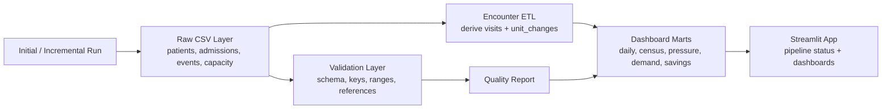

# Hospital Capacity Analytics App

Synthetic hospital capacity analytics demo.

This project is a public-safe technical demo. It combines a Python synthetic data generator, container-local raw data, validation reports, derived encounter tables, dashboard-prepared outputs, and a Streamlit dashboard. The local version does not use persistent cloud storage; data edits are intended for demo sessions only.

The raw generated layer is event-level. It stores patient demographics in `patients.csv` and hospital activity in `patient_events.csv`; visit-level tables are derived during ETL rather than stored as raw source files.

## Current status

This project is under active development. The original draft is preserved as source material under `docs/original-draft-readme.md`, and its sanitized migration plan is under `docs/sanitized-migration-plan.md`.

## Data safety boundary

All demo data must remain synthetic or explicitly public-safe.

Do not add real SHA data, patient data, internal screenshots, internal table names, private operational numbers, credentials, local network paths, or confidential documents.

## Project layout

```text
hospital-capacity-app/
├── ci/                        Draft CI workflow reference
├── config/                    Safe environment/profile examples only
├── dashboard/streamlit/       Current dashboard draft
├── dashboard/streamlit/utils/ Shared dashboard data, report, and chart helpers
├── data/synthetic/            Synthetic CSV samples
├── data/container/            Container-local raw, backup, and report data
├── data/etl_prepared/         Derived visit-level ETL output
├── data/dashboard_prepared/   Aggregated dashboard output destination
├── docs/                      Draft documentation and migration notes
├── etl/event_editor/          Raw event editor helpers
├── etl/pipeline/              Local ETL pipeline runners
├── etl/synthetic_data_generator/
├── notebooks/
└── tests/python/
```

## Current local workflow

Install Python dependencies from this folder:

```sh
python -m venv .venv
source .venv/bin/activate
pip install -r requirements.txt
```

Generate synthetic CSV files:

```sh
python etl/synthetic_data_generator/generate_fake_data.py
```

The generated raw source files include:

```text
patients.csv
admission_chart.csv
patient_events.csv
facilities.csv
services.csv
units.csv
diagnoses.csv
capacity.csv
population_growth.csv
```

`admission_chart.csv` stores one admission/start-state row per visit, including admitted unit, service, diagnosis, facility, admission time, and admission type. `patient_events.csv` stores updates after admission with `type` values of `location`, `service`, `diagnosis`, and `discharge`. Open inpatient encounters simply do not have a discharge event. The ETL derives analytical `visits` from admission chart rows plus the latest service, diagnosis, location, and discharge events.

Initialize the local demo dataset and rebuild the DuckDB/dashboard-prepared outputs:

```sh
python etl/pipeline/initialize_demo_dataset.py
```

Each run clears the previous container-local raw/report files and overwrites `data/dashboard_prepared/` with the latest aggregated outputs to limit local storage use.

The ETL also writes derived visit-level tables to:

```text
data/etl_prepared/
└── visits.csv
```

Run the Streamlit dashboard draft:

```sh
streamlit run dashboard/streamlit/Home.py
```

Run the same dashboard in a local container:

```sh
docker compose up --build
```

Then open:

```text
http://localhost:8501
```

The local compose setup mounts `./data` into the container, so generated raw files, backup files, ETL outputs, and dashboard-prepared CSVs remain available on your machine after the container stops.

Stop the local container:

```sh
docker compose down
```

Run Python tests:

```sh
pytest tests/python
```

## Demo controls

The Streamlit home page includes three main runtime actions:

- **Initial First Month Data** regenerates the initial synthetic raw layer, validates it, rebuilds ETL/dashboard outputs, and starts a new `initial_dataset` job log entry.
- **Incremental Run(add next-day data)** appends the next simulated day of raw data, validates duplicate/overlap rules, rebuilds downstream tables, and records an `incremental_run` job.
- **Reset Demo Runtime** clears local runtime artifacts after confirmation. It removes generated raw data, backups, reports, run logs, ETL-prepared tables, and dashboard-prepared tables. It does not remove `data/synthetic/sample_data`.

The reset target folders are:

```text
data/container/raw/
data/container/backup/
data/container/reports/
data/container/logs/
data/etl_prepared/
data/dashboard_prepared/
```

## Pipeline workflow

The local demo has two run modes:

- `initialize_demo_dataset.py` performs a full demo refresh. It regenerates synthetic raw files, validates the source data, rebuilds derived encounter tables, and rewrites dashboard-ready outputs.
- `incremental_run.py` simulates the next day of activity. It appends new raw rows to selected source tables, validates the incremental batch, then rebuilds the derived/dashboard tables from the full raw history.



See [ETL Architecture / Data Flow](docs/etl-architecture-data-flow.md) for the detailed flow.

### Incremental model

The incremental model treats the raw event layer as the source of truth:

```text
Current raw history
        |
        v
Find latest simulated date and next IDs
        |
        v
Generate one new simulated day
        |
        v
Append only to raw source files
  - patients.csv
  - admission_chart.csv
  - patient_events.csv
  - capacity.csv
        |
        v
Validate duplicate keys and overlap with existing raw rows
        |
        v
Rebuild derived encounter/dashboard outputs
```

`visits.csv` is not maintained as an incremental source table. It is rebuilt from `admission_chart.csv` and `patient_events.csv` so the dashboard always reflects the complete event history, including late discharge events for existing active visits.

### Data check layer

The data check layer exists in two places:

- `data/container/reports/data_check_report.csv` is written during the local pipeline run.
- `data/dashboard_prepared/quality.csv` is the dashboard-facing copy used by the Data Quality page.

The Streamlit home page shows a compact pipeline status summary. The full check details live in the **Data Quality** page and in the CSV reports above.

### Run history

ETL actions are wrapped by a lightweight `EtlJob` context manager in `etl/pipeline/job_logger.py`.

Each job writes one audit row to:

```text
data/container/logs/run_history.csv
```

The run history captures:

```text
job_id
job_type
status
started_at
finished_at
duration_seconds
params_json
metrics_json
message
```

The Streamlit **Pipeline Status** panel includes a **Run History** tab that shows recent jobs and lets users inspect parameters and metrics for a selected `job_id`.

Current job types include:

- `initial_dataset`
- `incremental_run`
- `user_editor_update`
- `etl_refresh`
