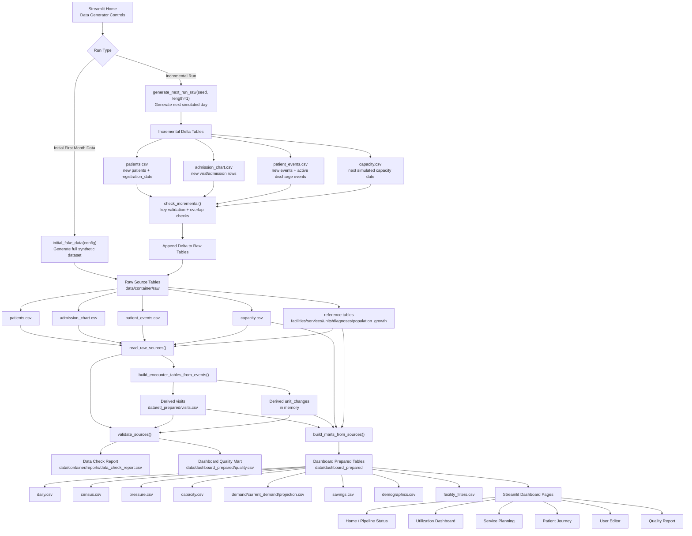

# ETL Architecture / Data Flow

```mermaid
flowchart TD
    A["Streamlit Home<br/>Data Generator Controls"] --> B{"Run Type"}

    B -->|"Initial First Month Data"| C["initial_fake_data(config)<br/>Generate full synthetic dataset"]
    B -->|"Incremental Run"| D["generate_next_run_raw(seed, length=1)<br/>Generate next simulated day"]

    C --> E["Raw Source Tables<br/>data/container/raw"]
    D --> F["Incremental Delta Tables"]

    F --> F1["patients.csv<br/>new patients + registration_date"]
    F --> F2["admission_chart.csv<br/>new visit/admission rows"]
    F --> F3["patient_events.csv<br/>new events + active discharge events"]
    F --> F4["capacity.csv<br/>next simulated capacity date"]

    F1 --> G["check_incremental()<br/>key validation + overlap checks"]
    F2 --> G
    F3 --> G
    F4 --> G

    G --> H["Append Delta to Raw Tables"]
    H --> E

    E --> E1["patients.csv"]
    E --> E2["admission_chart.csv"]
    E --> E3["patient_events.csv"]
    E --> E4["capacity.csv"]
    E --> E5["reference tables<br/>facilities/services/units/diagnoses/population_growth"]

    E1 --> I["read_raw_sources()"]
    E2 --> I
    E3 --> I
    E4 --> I
    E5 --> I

    I --> J["build_encounter_tables_from_events()"]

    J --> J1["Derived visits<br/>data/etl_prepared/visits.csv"]
    J --> J2["Derived unit_changes<br/>in memory"]

    I --> K["validate_sources()"]
    J1 --> K
    J2 --> K

    K --> K1["Data Check Report<br/>data/container/reports/data_check_report.csv"]
    K --> K2["Dashboard Quality Mart<br/>data/dashboard_prepared/quality.csv"]

    J1 --> L["build_marts_from_sources()"]
    J2 --> L
    E4 --> L
    E5 --> L

    L --> M["Dashboard Prepared Tables<br/>data/dashboard_prepared"]

    M --> M1["daily.csv"]
    M --> M2["census.csv"]
    M --> M3["pressure.csv"]
    M --> M4["capacity.csv"]
    M --> M5["demand/current_demand/projection.csv"]
    M --> M6["savings.csv"]
    M --> M7["demographics.csv"]
    M --> M8["facility_filters.csv"]

    M --> N["Streamlit Dashboard Pages"]

    N --> N1["Home / Pipeline Status"]
    N --> N2["Utilization Dashboard"]
    N --> N3["Service Planning"]
    N --> N4["Patient Journey"]
    N --> N5["User Editor"]
    N --> N6["Quality Report"]
```
